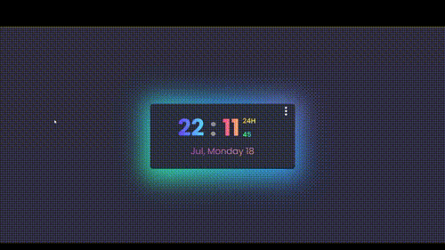

 # Welcome to the tick tock clock Web App! 🍃

This tick tock clock web app is made using `React.js`, `Styled Components`. If you want to see a live version of the app, you can visit [this link](https://mouhametnd-react-clock.netlify.app/). 

## Links
- My Linkedin [Linkedin](https://www.linkedin.com/in/mouhametndiaye/)
- My email ahmetndiaye404@gmail.com
- Live Project [ Clock Web App](https://mouhametnd-react-clock.netlify.app/)

## Challenge  

###  Users should be able to:

- See responsive clock with any device.
- Toggle between 12 and 24 hour format.
- Toggle between dark and light mode.
- Save preferences to local storage.

### Built with

- React - JS library
- Styled Components - CSS in JS library
- LocalStorage - To save the games added to localStorage to render them again when the user refresh the page.
- Mobile-first workflow
- CSS Flexbox
- CSS Grid
- CSS custom properties
- Semantic HTML5 markup

## Preview of the App

